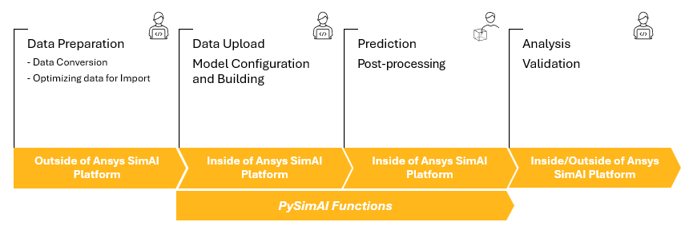

.. _index:

PySimAI documentation
=====================

Release v\ |version| (:ref:`Changelog <changelog>`)

PySimAI is part of the `PyAnsys <https://docs.pyansys.com>`_ ecosystem that allows you to use SimAI within
a Python environment of your choice in conjunction with other PyAnsys libraries and external Python
libraries. With PySimAI, you can manage and access your data on the platform from within Python apps and
scripts.

The following illustration depicts the Ansys SimAI platform and PySimAI library user workflow.

For more information, see the `Ansys SimAI User's guide <https://ansyshelp.ansys.com/public/account/secured?returnurl=/Views/Secured/SimAI/v000/en/SimAI_ug/SimAI_ug/C_UG_SAI_ansys_simai_worflow.html>`_

.. grid:: 3

    .. grid-item-card:: :octicon:`tools` User guide
        :link: ref_user_guide
        :link-type: ref

        Guides on how to achieve specific tasks with PySimAI.

    .. grid-item-card:: :octicon:`file-code` API reference
        :link: api_reference
        :link-type: ref

        Describes the public Python classes, methods, and functions.

    .. grid-item-card:: :octicon:`play` Examples
        :link: examples/index
        :link-type: doc

        A collection of examples demonstrating the capabilities of PySimAI.

Requirements
------------

PySimAI requires Python 3.9 or later.

.. toctree::
   :maxdepth: 1
   :hidden:

   Home<self>
   user_guide
   api_reference
   examples/index
