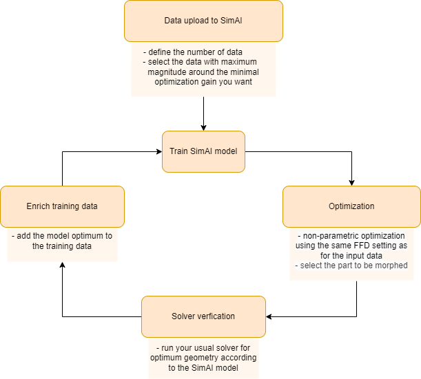

Non-parametric optimization
=============================

SimAI's non-parametric optimization feature is a process used to improve the performance of a given geometry
(referred to as the baseline geometry) by applying smooth, data-driven deformations based on predicted sensitivity maps.

This approach is especially relevant when there are no predefined building parameters, and it would be too difficult to
define them retroactively.
In such cases, non-parametric optimization must be performed, as it enables you to optimize the provided shape directly
by applying smooth and continuous deformations to the baseline geometry.
This helps you explore the design space and make shape changes based on an objective function
without generating new geometries themselves or reparametrizing existing designs.

This is where automorphing comes in:
SimAI uses this approach to automatically generate new geometries through goal-driven shape deformations
directly applied to non-parameterized baseline geometries.

Unlike traditional parametric methods, this approach requires no predefined design variables and
enables you to optimize existing geometries seamlessly, directly within the SimAI platform.

Please note that the feature is currently available via SDK only through the method ``run_non_parametric``.
For more information, see :ref:`Optimization<optimizations>`.

How to perform non-parametric optimization
-------------------------------------------

**Requirements for the training data:**

Robust data preparation is the first step to successfully running the non-parametric optimization.
Make sure the maximum magnitude within the simulation data is around the minimal optimization gain you want.
For example, for a reduction of at least 4% on the drag, make sure there is around 4% drag difference
between the best and the worst from the simulation data.

Workflow to perform an effective non-parametric optimization
-------------------------------------------------------------

Step 1. Data upload to SimAI
^^^^^^^^^^^^^^^^^^^^^^^^^^^^^

1. Select the surface geometries that you want to optimize based on the requirements above.
#. | Prepare the geometry files to be compliant with SimAI.
   | For more information, see the online `SimAI User's Guide`_.
#. Upload those geometry files to SimAI.

.. _SimAI User's Guide: https://ansyshelp.ansys.com/public/account/secured?returnurl=/Views/Secured/SimAI/v000/en/SimAI_ug/SimAI_ug/C_UG_SAI_simai_presentation.html

Step 2. Train SimAI model
^^^^^^^^^^^^^^^^^^^^^^^^^^

1. Create a project in SimAI and assign the geometries to it.
#. | Build an AI model, trained with those geometries.
   | When the AI model is finished, it creates a workspace for that model training and automatically chooses a reference sample.

Step 3. Optimization
^^^^^^^^^^^^^^^^^^^^^

1. Perform a non-parametric optimization by calling the ``run_non_parametric`` function.
#. | At each optimization loop, automorphed geometries are uploaded to the workspace.
   | The number of automorphed geometries uploaded to the workspace depends on the ``n_iters`` configured.
#. Run predictions, postprocessings, etc. on the generated geometries, if needed.

Step 4. Solver verification
^^^^^^^^^^^^^^^^^^^^^^^^^^^^

1. Download randomly selected geometries produced from the various iteration stages throughout the optimization process.
#. Run a simulation in your solver to select the optimum among the downloaded geometries.

Step 5. Enrich training data
^^^^^^^^^^^^^^^^^^^^^^^^^^^^^

1. Add the chosen optimums as new training data to your model.
#. Build a new AI model with those new data.
#. Use again the SDK non-parametric optimization feature by calling the ``run_non_parametric`` function.
#. Repeat the workflow from Step 3 at least three times. It is usually the number needed to achieve good results.

Stop running optimization whenever the performance result obtained on Step 4 is satisfactory.
The idea is to make the model learn from its previous prediction.

Code example
-------------

For a complete code example demonstrating non-parametric optimization, see the tutorial
:ref:`ref_non_parametric_optimization`.
